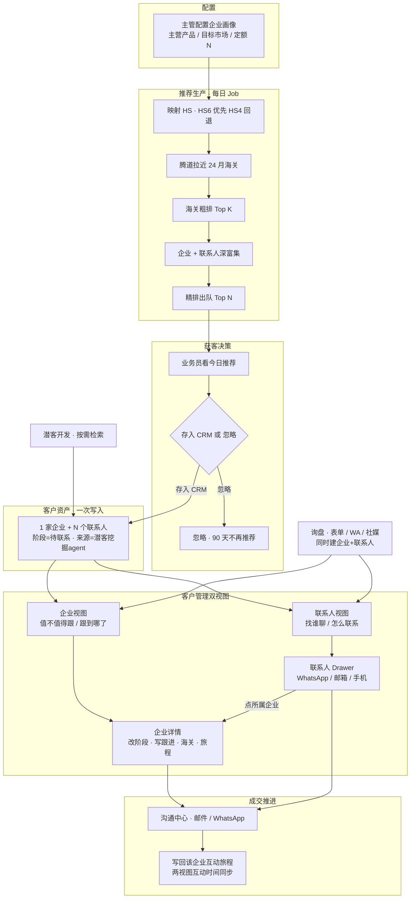
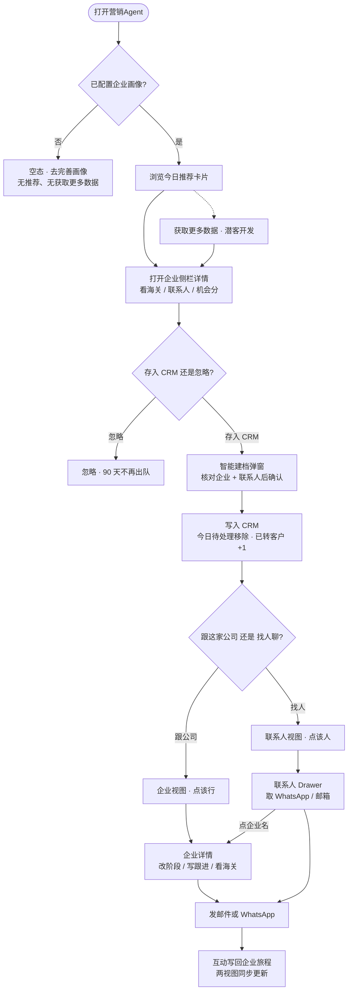

# 主动营销 Agent · 产品需求文档

**产品：** 营销Agent（集成于外贸管理软件）  
**版本：** V1.10 · 一期  
**数据：** 腾道海关 + 腾道/Hunter 企业联系人  
**外调原则：** 以线索推荐精准度为先，**不设**腾道/Hunter 日调用成本上限。离线库是页面时延缓存（write-through），不是「省点数」的挡板。  
**原型：** `trade-agent/proactive-agent-v1.html`（推荐）· `trade-agent/crm-v2.html`（列表）· `trade-agent/customer-detail.html`（详情）

---

## 1. 背景与目标

现有系统已具备沟通互动、客户管理、条件检索、企业画像。获客仍以**等询盘**为主，缺少按画像主动找买家的能力。

**定位：** 不是海关搜索工具，而是按企业画像每日推送可跟进买家；用户把线索 **存入 CRM 后，在企业 / 联系人双视图里跟进成交**。

| 目标（上线 3 个月） | 指标 |
|---------------------|------|
| 主动获客效率 | 日均有效线索触达 ≥ 10 |
| 闭环转化 | 转客户率 ≥ 60%；转后 7 日内触达率 ≥ 30% |
| 模块融合 | 100% 带来源；沟通 100% 同步 CRM；转客户后 100% 同时出现在企业视图与联系人视图 |

**一期不做：** 全自动外联、多 Agent 编排、自然语言搜索、官网/新闻/融资/展会等第三方数据。

---

## 2. 一期范围

| 能力 | 说明 |
|------|------|
| 企业画像（只读） | 主营产品、目标市场、每日定额；Agent 内不编辑 |
| 每日推荐 | 定额推送 + 机会分 + AI 理由 + 海关摘要 |
| 转客户 | 无线索池；存入即写入客户管理，**企业 + 联系人同时出现在双视图** |
| 一键邮件 / WhatsApp | 复用沟通模块，记录沉淀到所属企业互动旅程 |
| 客户管理双视图 | **企业视图管进度，联系人视图管触达**；仅企业有详情页 |

**数据源仅两类：** 腾道海关贸易、腾道/Hunter 联系人。页面只读离线库（保证打开速度）；**每日 Job 与潜客开发检索主动外调**，把新鲜海关、企业资料、可验证联系人写回离线后再打分。

---

## 3. 核心流程

获客 Agent 的价值不在「看完推荐」，而在 **把推荐变成可跟进的客户资产**。存入 CRM 后，用户用两个视图分工：企业管成交进度，联系人管触达。

| 角色 | 诉求 |
|------|------|
| 业务员 | 每天打开就有可跟进买家；存入后立刻知道跟哪家公司、找哪个人聊 |
| 主管 | 配画像与定额；看推荐产出、转客户率、企业漏斗 |

### 3.1 主路径：推荐 → 存入 CRM → 双视图跟进

```
企业画像（主管配置：主营产品 / 目标市场 / 定额 N）
        ↓ 只读
营销Agent · 今日推荐
        ↓ 点卡片看海关、联系人、机会分
        ├─ 忽略 → 90 天不再推荐
        └─ 存入CRM（智能建档）
                ↓ 一次写入
         ┌──────┴──────┐
         ▼             ▼
    客户（企业）     联系人 × N
    阶段=待联系      无独立阶段
    来源=潜客挖掘agent
         │             │
         ▼             ▼
  客户管理 · 企业视图          客户管理 · 联系人视图
  这家公司值不值得跟、跟到哪   找谁聊、怎么联系上、最近聊了什么
         │             │
         ├─ 点企业行 ──┘── 企业详情（改阶段、写跟进、海关、全公司对话）
         └─ 点联系人行 ─── 右侧 Drawer（触达信息）；点所属企业名仍进企业详情
                ↓
         沟通中心（邮件 / WhatsApp）
                ↓
         记录回到「该企业互动旅程」+ 联系人列表最近一条
```

| 步骤 | 用户做什么 | 系统落什么 | 接下来去哪 |
|------|------------|------------|------------|
| 1 看推荐 | 在营销Agent 刷今日卡片 | 只读离线推荐，不改 CRM | 点卡片开 Agent 侧栏详情 |
| 2 存入 CRM | 详情点「存入CRM」，核对企业 + 联系人后确认 | **同时**创建 1 家企业 + 表单内全部联系人；企业阶段=待联系 | 该卡片从今日待处理消失；「已转客户」+1 |
| 3 跟企业 | 打开客户管理 **企业视图**，点该行 | 企业详情：阶段、跟进、海关、互动旅程、联系人卡片 | 改阶段、写跟进只在这里 |
| 4 找人聊 | 切到 **联系人视图**，或企业详情点某人 | 右侧 Drawer：WhatsApp / 邮箱 / 手机 / 社媒 / 职务 / 备注 | 发邮件、WhatsApp；不新开联系人页 |
| 5 开聊 | 对具体人发邮件 / WA | 事件写入所属 **企业** 互动旅程，并挂到该联系人 | 两视图的「互动内容 / 时间」同步更新 |

**一条铁规则：** 存入 CRM = 企业 + 联系人成对出现。没有「只建线索、不进客户管理」的中间池；也没有「只建企业、联系人稍后补」的 Agent 主路径（表单联系人可增删，但不能存一个空壳企业却丢掉已富集的采购联系人）。

### 3.2 两条辅路径（不替代主路径）

**询盘先进人：** WhatsApp / 表单 / 社媒进线 → **同时**建企业+联系人（企业资料/海关可空）→ 联系人视图先回聊 → 点所属企业进详情补资料、推阶段。

**潜客开发补量：** 今日推荐不够时，在潜客开发按海关条件再检索 → 同样走「存入CRM」→ 进入同一套双视图，来源仍记为潜客挖掘/潜客开发，不另开线索池。

### 3.3 存入后，两个视图怎么选

| 我想… | 用哪个视图 | 点进去做什么 |
|--------|------------|----------------|
| 看这家公司跟到哪了、改阶段、写跟进、看海关 | **企业视图** → 企业详情 | 销售进度只挂企业 |
| 找采购经理电话/邮箱、回私信、看最近谁互动过 | **联系人视图** → Drawer | 联系人无阶段；列表上的阶段 = 所属企业阶段（只读） |
| 从人跳回公司 | 联系人行上的所属企业名 | 进入同一套企业详情 |

### 3.4 业务流程图

跨角色、跨系统：推荐如何被生产，以及存入后如何成为可运营的客户资产。辅路径（询盘、潜客开发）汇入同一套双视图，不另开线索池。



### 3.5 用户流程图

业务员从打开营销Agent 到存入 CRM、再在双视图里跟进的点击路径。判断节点是页面上的真实选择。



---

## 4. 产品架构

### 4.1 用户闭环（核心）

模块怎么接，以用户动作为准。后台 Job 服务于「今日有得推」，不出现在用户主路径里。

```
企业画像 ──(只读)──► 营销Agent（今日推荐 / 存入CRM / 忽略）
                          │
                          │ 存入CRM：1 企业 + N 联系人
                          ▼
                    客户管理（双视图，同一套数据）
                    ├── 企业视图 ──► 企业详情（阶段 / 跟进 / 海关 / 旅程 / 联系人）
                    └── 联系人视图 ──► Drawer（触达）──► 所属企业详情
                          │
                          ▼
                    沟通中心 ──► 写回企业互动旅程 + 联系人最近互动

潜客开发（按需检索）── 同样「存入CRM」──► 同一套双视图
询盘（表单/WA/社媒）── 同时建企业+联系人 ──► 同一套双视图（海关可空）
```

### 4.2 推荐数据链路（后台）

```
企业画像（主营产品 / 目标市场 / 定额 N）
      ↓ 主营产品 → 品类 → HS6（优先）/ HS4（回退）
营销Agent · 每日 Job（精准度优先，主动拉新）
      ↓ ① 自适应切片：row-count 决定用 HS6 还是回退 HS4
      ↓ ② 对该切片拉近 24 月进口 → 本地切近12月 + 上年，写 trade_record（不因离线「够数」跳过）
      ↓ ③ 海关粗排 Top K → 企业/联系人深富集（腾道 + Hunter 含验证）
      ↓ ④ 全指标精排，Top N 出队
用户打开推荐 / Agent 详情 / CRM 贸易洞察  → 只读离线库（不阻塞等待外调）
```

---

## 5. 企业画像与 HS 映射（F-001）

Agent **只读**公共画像三个字段：主营产品、目标市场、每日定额 N。页顶摘要 +「完善画像 →」。缺主营或目标市场 → 今日推荐空态。

画像**没有 HS 字段**。海关查询按 HS + 目的国过滤，所以一期必须把主营产品解析成 HS，用户不用填编码。

### 5.1 为什么要解析到 HS

| 层 | 用户看到 | 系统用来查 |
|----|----------|------------|
| 主营产品 | 「LED 灯具」「不锈钢厨具」 | 不能直接打腾道/离线索引 |
| 品类 | 照明 / 厨房用品 | 映射表的中间层 |
| HS | 9405、7323 | 离线检索与腾道 `hsCode` 的查询键 |

**查询粒度：HS6 优先，HS4 回退，禁止 HS2。**  
HS6（子目）把「同品目里不相关的货」挡在召回之外，是精准度的第一道闸。HS4 只在该 HS6×国家进口商过少时回退，避免空池。HS2（章）过宽，会灌入大量不相关进口商，**一律不用**。

打分时：企业 `top_hs` 与查询码 **最长前缀匹配**（查 9405.40 则 9405.40 满分档，仅 9405 其它子目走较低档，见 I2）。

### 5.2 映射链路

```
画像.主营产品（原文）
    → 分词 / 同义词（led灯、LED lighting、灯具）
    → 命中 hs_product_map.关键词
    → 得到 行业 + 品类 + hs4[]（必填）+ hs6[]（可选，仅展示/精排）
    → 写入 profile_hs_snapshot.resolved_hs4[]
```

| 命中结果 | 处理 |
|----------|------|
| 命中 1 个品类 | 用该品类 **HS6**（无 HS6 则 HS4） |
| 命中多个品类 | 并集，**最多 8 个查询码**（HS6 优先，按关键词匹配分排序） |
| 只命中行业、未到品类 | 用该行业「默认品类」的 HS6/HS4；页顶提示「已按行业泛匹配」（匹配弱，精排降权） |
| 全部未命中 | 腾道辅助校准一次；仍失败则 **不查询、不出推荐**，空态：「无法识别主营产品，请改成更具体的品类词」 |

映射表仍由运营维护。**映射未命中或置信度低时**，Job 可用腾道商品描述/HS 辅助检索做一次校准（写入 `profile_hs_snapshot`，供下次复用），禁止用 HS2 盲查。校准失败 → 空态「无法识别主营产品」，不出推荐。

### 5.3 一期覆盖范围

一期只保证下表 **行业 × 品类** 的关键词能落到 HS6（或至少 HS4）。不在表内的行业不做推荐（空态引导改主营产品），不扫 HS 全库。

| 行业 | 品类（一期） | 查询用 HS4（主码） | 关键词示例 |
|------|--------------|-------------------|------------|
| 照明 | LED 灯具 / 户外灯 / 灯串灯带 | 9405 | LED、灯具、downlight、灯带 |
| 家居家具 | 家具 / 床垫 / 灯饰家具 | 9403、9401、9404 | 家具、sofa、mattress |
| 厨具餐具 | 不锈钢厨具 / 餐具 | 7323、8215、4419 | 厨具、cookware、不锈钢锅 |
| 五金工具 | 手动工具 / 电动工具配件 | 8201–8206、8467 | 工具、扳手、drill |
| 纺织服装 | 针织服装 / 梭织服装 / 家纺 | 6109、6110、6203、6204、6302 | T恤、服装、家纺 |
| 电子电器 | 消费电子配件 / 小家电 | 8504、8518、8509、8516 | 充电器、耳机、小家电 |
| 汽摩配件 | 汽车零件 | 8708、8714 | 汽配、bumper、brake |
| 塑料橡胶 | 塑料制品 | 3924、3926 | 塑料、storage box |
| 建材五金 | 建筑金属件 / 紧固件 | 7308、7318、7610 | 紧固件、铝型材 |
| 机械设备 | 通用机械零件 | 8481、8483、8482 | 阀门、轴承、传动 |

上表 HS4 为**种子主码**；词表同时维护可选 `hs6[]`。完整词表在 `hs_product_map`（一词可对多个 HS6/HS4）。运营可加行，不改代码。

**明确不覆盖（一期）：** 整章盲查（如用 84 查所有机械）、化工原料细目、农产品、医械注册类。原因是品类漂移会直接拉低推荐精准度，不是因为调用次数。

### 5.4 查询时 HS 怎么用

每日 Job **先对每个「查询码 × 目标国」做 `row-count`，再决定粒度**：

| row-count（近 12 月进口商去重） | 查询码 | 目的 |
|--------------------------------|--------|------|
| ≥ 30 | 用映射给出的 **HS6** | 精召回，减少同品目噪声 |
| < 30 或无 HS6 | **回退该品目 HS4** | 保证有池可排 |
| HS4 仍 < 8 | 保留该切片，有多少算多少；可叠加 `goodsDesc` 含画像关键词 | 宁缺毋滥，不升到 HS2 |

腾道与离线检索条件相同：

```
catalog = imports
hsCode  = 上表选定的 HS6 或 HS4
countryOfDestinationCode ∈ 画像目标市场
时间窗口：近 12 个月（拉数时腾道跨度可到 24 月，本地切出「近 12 月」+「再往前 12 月」供 I4/I6）
主体：进口商 importer
可选：goodsDesc 含画像关键词（仅切片过宽或过窄时）
```

目标市场为空则不出队。多市场 = 多目的国分别切片，**禁止**把多国混成一次宽查。

`row-count` **是每日 Job 的常规步骤**，用来选粒度，不是运营抽检。

---

## 6. 每日推荐（F-002）

### 6.1 页面

侧边栏「营销Agent」，角标 = 今日待处理数。

| 区块 | 内容 |
|------|------|
| 顶部 | 标题 + 画像摘要 +「完善企业画像」 |
| 统计 | 今日推荐 / 累计发现 / 已转客户 |
| Feed | 双列卡片；工具栏：批量忽略、批量转客户 |
| 底部 | 已忽略列表 · 去客户管理看已转客户 |

**卡片：** 企业名 · 机会分 · 国家/类型 · 时机标签（换供窗口 / 新供应商 / 新品类，有则显示）· AI 理由 · 三格（近12月采购额 / 最近进口 / 采购趋势）· 可触达联系人（采购角色 + 邮箱是否已验证）· 底部 **存入CRM / 忽略**。  
**卡片不展示：** HS 标签、完整贸易明细。点击卡片非按钮区域进详情。

| 操作 | 行为 |
|------|------|
| 查看 | 点卡片 → 侧栏详情（读离线库） |
| 存入CRM | 智能建档 → 写入客户管理，阶段=待联系，来源=潜客挖掘agent |
| 忽略 | 90 天内不再推荐 |

### 6.2 推荐生成：鲜度优先，两段精排

用户打开页面 **不阻塞等待外调**（读昨晚 Job 写好的离线库）。Job **禁止**「离线数量够了就跳过腾道」——缓存命中不代表品类准、海关新、联系人可触达。

**目标：** 在正确的品类 × 市场上，用足够新、足够全的特征排出真正可跟进的买家。出队人数仍是定额 N，但候选要经过深富集后再排，而不是用过期海关硬凑 N 家。

**鲜度 SLA（不满足则该切片/该企业必须外调，不得用旧缓存出队）：**

| 对象 | SLA | 原因 |
|------|-----|------|
| 切片海关 `data_through_date` | ≥ 今天−**7** 天 | I4/I5/I6 对近窗敏感；90 天缓存会把停采企业当活跃 |
| 出队企业的 `company_cache` | ≥ 今天−**3** 天 | 官网/行业/规模描述参与展示与 I10 |
| 出队企业的 `contact_cache` | 当日 Job 已跑 ContactResolver | I9/I10 不得因「没查过」而 skip |

工程截断（防超时，**不是成本闸**）：单切片按近 12 月进口额保留最多 **500** 家进口商；Job 切片并发与重试受供应商速率限制约束。`GET /v2/account` 只做健康检查，**不因余额停 Job**。

```
1. 读画像 → 映射 HS6/HS4（hs_product_map）
     映射失败或低置信 → 腾道商品/HS 辅助校准一次；仍失败则空态，不出队
2. 对每个「查询码 × 目标国」：
     POST /v2/trade/row-count
     按 §5.4 选定 HS6 或回退 HS4
     POST /v2/trade 拉近 24 月进口（本地切 近12月 + 再往前12月）
     upsert trade_record → 重算 trade_snapshot、slice_coverage
3. 候选池 = 该切片进口商
     去重：CRM 已有、90 天忽略、近 7 天已推荐
4. Pass-1 粗排（只评 I1–I6，海关特征）
     取 Top K，K = max(8N, 80)
5. 对 Top K 深富集（每家都做，不按「有 cache 就跳过」，只按 SLA 跳过）：
     GET /v2/company
     ContactResolver：腾道 contact → Hunter Domain/Email/Domain Search → Verifier
6. Pass-2 精排（I1–I6 + I9 + I10）
     机会分 < 60 或 I1+I2 < 5 → 过滤
     I9 因供应商故障未评估 → 该企业可出队但排在已评估且有采购邮箱的之后
     同分：验证采购邮箱 > 有采购角色 > 仅有海关
7. Top N 出队；LLM 写 ai_summary（不打分）
```

仍不足 N 家：有多少出多少，页顶提示「本画像下可跟进买家偏少」，**不放宽到 HS2、不把低分企业凑数**。

| 步骤 | 读/写 | 腾道 | Hunter |
|------|-------|------|--------|
| 解析 / 校准 HS | `hs_product_map` → `profile_hs_snapshot` | 映射失败时辅助检索 | 否 |
| 选粒度 | `slice_coverage` | **每日** `POST /v2/trade/row-count` | 否 |
| 发现 + 鲜度 | upsert `trade_record` | **每日** `POST /v2/trade`（按切片，不因离线「够数」跳过） | 否 |
| 企业资料 | `company_cache` | Top K 且 cache 超 3 天 → `GET /v2/company` | 否 |
| 联系人 | `contact_cache` | Top K 必跑 `contact` | 邮箱查找 + **验证** |
| 打分出队 | `daily_recommendation` | 否 | 否 |

**与 V1.8 的关键差异：** 不再用「≥3N + 90 天时效 + 每切片 10 家」当够用闸门；不再只对 Top 2N 补联系人；Hunter 不再「有腾道邮箱就停」。粗排之后必须深富集，否则 Reachability 失真，高海关分、联不上的企业会挤掉真正能跟进的买家。

### 6.3 定额与去重

- 出队人数 = 画像定额 N；按 `opportunity_score` 降序。
- 排除：客户管理已有同一企业（`tendata_company_id` / 清洗后企业名）、90 天忽略、当日已出队。
- 高匹配：机会分 ≥ 85，统计区单独计数。

### 6.4 Agent 企业详情（转客户前）

侧栏，不是 CRM 详情。

```
顶部：方形 Logo、企业名；类型标签（进口商 / 分销商 / 出口商，仅一个）；国家标签（与类型标签同级、对比更强）
灰色基本信息卡：成立时间 · 行业 · 年采购额；地址；企业简介；邮箱 / 电话 / 官网三张校验卡
AI 推荐理由：3–5 条用户可读要点（LLM，不展示评分规则）
Tab（下划线）：联系人 | 贸易数据 | 参展情况 | RFQ清单
联系人：卡片（职务、可联系、邮箱、电话、社媒、偏好、沟通建议、发邮件；不展示 AI 洞察）
参展情况 / RFQ清单：一期无第三方展会与 RFQ 源，Tab 保留；无数据文案分别为「暂未找到公开参展记录」「暂未找到公开报价请求」，不隐藏 Tab
底部：存入CRM · 忽略
```

贸易数据 **仅采购商、平铺、无子 Tab**（原海关数据）：

1. 采购概览（卡片）：年采购额、采购频数、最近采购时间、累计供应商数、累计产品数、累计采购国家  
2. 贸易明细：交易日期、产品描述、海关编码、供应商、目的国、金额、数量、重量；无筛选  

### 6.5 转客户

今日推荐卡片或企业详情点「存入CRM」→ **直接写入客户管理**，不弹智能建档。使用推荐里的企业与联系人默认信息；阶段=待联系，来源=`潜客挖掘agent`。

批量转客户仍弹出确认（列出企业名单），确认后同样直接写入。

后台同时写入：`opportunity_score`、`score_breakdown`、`ai_summary`、`explain_json`、`hs_summary`、`tendata_company_id`；互动旅程记一条「Agent 转客户」；该企业从今日待处理移除；`company_key` 进入 CRM **每日**增量同步队列。写入后立刻可在客户管理双视图找到，不经过待办/线索池中转。

### 6.6 存入后去哪（双视图）

确认建档后，用户主操作面从营销Agent 切到客户管理。推荐 Feed 不再承担跟进。

| 落点 | 企业视图 | 联系人视图 |
|------|----------|------------|
| 出现什么 | 一行企业：名称、国家、阶段=待联系、来源=潜客挖掘agent | 建档时的每一位联系人各一行：姓名、所属企业、联系方式、职位 |
| 用户点什么 | 整行 → **企业详情**（改阶段、写跟进、海关、旅程、联系人卡片） | 整行 → **联系人 Drawer**（只看/改这个人的触达信息） |
| 从人到公司 | — | 点「所属企业」名 → 同一企业详情 |
| 统计区「已转客户」 | 营销Agent 该数字可点进客户管理，默认 **企业视图** 并带上来源筛选 | 需要找人时再切联系人视图 |

批量转客户：每家同样写 1 企业 + N 联系人，全部进入双视图；失败的一家不影响已成功的。

Agent 详情底部「存入CRM」成功后，可提供轻量去向：**查看客户**（企业详情）/ **查看联系人**（CRM 联系人视图并定位该企业下的人）。一期至少保证前者。

---

## 7. 机会分

### 7.1 原则

1. **规则打分，AI 不打分。** AI 只根据命中证据写推荐理由。  
2. **10 个指标固定，规则可插拔。** 新数据源只加规则，不改指标编号和满分。  
3. **本期海关 + 联系人规则单独就能打出 70–90 分。** 不为未来才有的信号压低当前档位。  
4. **规模、活跃度用固定金额/批次档，不用分位数，不拿当天 15～20 条推荐当样本池。**

读数全部来自离线 `company_features`（海关聚合 + `contact_cache`），打分不调 API。

### 7.2 公式与拓展

```
指标得分 = min(满分, Σ 已启用且命中的规则分)
score_raw = 已评估指标得分之和
opportunity_score = round(100 × score_raw / evaluated_max)
evaluated_max = 已评估指标满分之和   // 本期默认 80（I7、I8 skip）
```

| 规则 | 条件 |
|------|------|
| 入队 | 机会分 ≥ 60 且 I1+I2 ≥ 5 |
| 高匹配 | 机会分 ≥ 85 |
| 星级 | ≥90→5；≥85→4；≥75→3；≥65→2 |

以后加融资/官网/展会：规则挂到现有指标（融资→I4，展会→I7），带 `source`+`enabled`。源未接入 = 规则关闭，不是 0 分。指标有封顶，海关已打满则新信号不再加。

**缺数据：** 整指标无可用规则 → skip。有海关但下滑 → 低分。联系人 **必须先跑 ContactResolver 再评 I9**；仅当供应商超时/故障才 skip I9，且精排时排到有采购邮箱的企业之后。已查但无采购邮箱 → 低分（1），不 skip。

不用「当天候选池分位数」：推荐只有十几家时 P90 会乱跳，同一企业分数不可比。I3/I5 改为固定美元额、批次数。

### 7.3 指标总表

| 维度 | 指标 | 满分 | 本期规则 | 以后可挂（关闭） |
|------|------|------|----------|------------------|
| Profile 30 | I1 目标市场 | 10 | 海关目的国 vs 画像 | — |
| | I2 行业匹配 | 10 | HS6 优先 / HS4 回退 / 品名词 | — |
| | I3 企业规模 | 10 | 近12月进口额**固定档** | 员工数、营收 |
| Demand 40 | I4 采购需求增长 | 15 | 进口额 YoY 固定档 | 融资、新品 |
| | I5 采购活跃度 | 10 | 近12月批次**固定档** | 官网更新 |
| | I6 需求变化 | 15 | 新供应商 / 换供 / 新 HS / 新目的国 | 招聘采购 |
| Timing 20 | I7 采购窗口 | 10 | skip | 展会、采购周期 |
| | I8 近期业务变化 | 10 | skip | 新闻、官网改版 |
| Reachability 10 | I9 联系人完整度 | 5 | 采购角色 / 验证邮箱 / 电话 | — |
| | I10 触达渠道 | 5 | LinkedIn / WA / FB / 官网 URL | — |

UI 维度条：Timing 显示 `—/20`，不显示 0。

### 7.4 各指标计算规则

**I1 · 目标市场（0–10）** · 互斥  

数据：`trade_record.countryOfDestinationCode` 众数 vs 画像 `targetMarkets[]`；大区用配置表（如北美、欧盟）。

| 条件 | 分 |
|------|----|
| 主要目的国 ∈ 目标市场 | 10 |
| 不在列表，但同大区 | 6 |
| 有进口记录，国家/大区都不匹配 | 2 |
| 无目的国信息 | **跳过 I1**（分母减 10） |

**I2 · 行业匹配（0–10）** · 互斥  

数据：企业 `top_hs` 与 **本次查询码** 最长前缀匹配；否则 `goodsDesc` 含画像关键词。发现阶段已按 HS6/HS4 过滤，出队企业 I2 多数为 6 或 10。

| 条件 | 分 |
|------|----|
| 与查询 **HS6** 一致，或 HS6 交集覆盖画像 HS6 ≥ 50% | 10 |
| 仅 HS4 命中（回退切片，或企业只有品目码） | 6 |
| 无 HS 交集，品名命中主营词 | 4 |
| 全无命中 | 0 |

**I3 · 企业规模（0–10）** · 互斥 · **固定档，不是分位**  

数据：`amount_12m`（USD）。无金额但有批次 → 3 分。不对照「当天推荐里谁更大」。

| 近 12 月进口额 | 分 | 含义 |
|----------------|----|------|
| ≥ 500 万 | 10 | 大买家 |
| 100 万 – 500 万 | 8 | 主力客户 |
| 20 万 – 100 万 | 6 | 可跟进的中小进口商 |
| 5 万 – 20 万 | 4 | 小单 |
| < 5 万 | 3 | 有进口痕迹 |

**I4 · 采购需求增长（0–15）** · 互斥  

数据：`(amount_12m − amount_prev_12m) / amount_prev_12m`。无上年基期但今年有货 → **6 分**（在采，不因缺对比年打 0）。稳定采购给中档，不把「没暴涨」打成差客户。

| YoY | 分 |
|-----|----|
| > 50% | 15 |
| 20% – 50% | 12 |
| −10% – 20%（含稳定） | 8 |
| −30% – −10% | 4 |
| < −30% | 2 |

**I5 · 采购活跃度（0–10）** · 互斥 · **固定档**  

数据：`batches_12m`。

| 近 12 月批次 | 分 | 含义 |
|--------------|----|------|
| ≥ 24 | 10 | 约每月 ≥2 批 |
| 12 – 23 | 8 | 约每月 1 批 |
| 6 – 11 | 6 | 有持续进口 |
| 2 – 5 | 4 | 偶发 |
| 1 | 3 | 仅一票 |

**I6 · 需求变化（0–15）** · 累加，封顶 15  

数据：近 6 月 vs 前 6 月/前 12 月 `trade_record`（exporter、hsCode、目的国）。

| 条件 | 分 |
|------|----|
| 近 6 月新增 ≥ 2 家供应商 | +5 |
| 供应商集中度明显上升（Top1 占比 ↑≥15pp 或 HHI 超阈值） | +4 |
| 近 6 月新出现画像相关 HS6/HS4 | +4 |
| 近 6 月新增进口目的国 | +3 |

| 样本 | 处理 |
|------|------|
| ≥ 12 月记录 | 四条都评 |
| 仅 6–12 月 | 只评新 HS、新目的国 |
| 不足 6 月 | **跳过 I6**，`evaluated_max` 减 15 |

**I7 / I8** · 本期跳过，不展示分值。

**I9 · 联系人完整度（0–5）** · 累加封顶 5  

数据：`contact_cache`。每日 Job 对 Top K **必跑** ContactResolver。未跑仅允许在供应商故障时 → **skip**（分母减 5，且精排降权）。已查询：

| 条件 | 分 |
|------|----|
| 采购相关角色（Purchasing / Buyer / 采购 / Procurement） | +2 |
| 验证邮箱（verified / valid） | +2 |
| 电话 | +1 |
| 已查但三项都无 | 1 |

**I10 · 触达渠道（0–5）** · 累加封顶 5  

数据：`contact_cache` 社媒字段 + `company_cache.website`。评的是「能不能联系上」，不是官网是否更新。

| 条件 | 分 |
|------|----|
| 有 LinkedIn | +2 |
| 有 WhatsApp 或可发 WA 的手机号 | +1 |
| 有 Facebook | +1 |
| 有企业官网 URL | +1 |

### 7.5 演算示例 · ABC Trading

画像：LED 灯具 → 查询码优先 HS6=9405.40（过少则回退 HS4=9405）；目标市场含美国。

| 指标 | 分 | 依据 |
|------|----|------|
| I1 | 10 | 美国 ∈ 目标市场 |
| I2 | 10 | 企业 9405.40 覆盖画像 9405 |
| I3 | 8 | $320 万（100 万–500 万档） |
| I4 | 12 | YoY +40% |
| I5 | 8 | 23 批（12–23 档） |
| I6 | 12 | 新供应商 +5、换供 +4、新目的国 +3 |
| I9 | 5 | 采购经理 + 验证邮箱 + 电话 |
| I10 | 3 | LinkedIn + 官网 |
| **score_raw** | **68** | |
| **机会分** | **85** | 68 ÷ 80 × 100 |

无联系人且 I9/I10 skip：60/70≈**86**。匹配上的进口商应落在 70–90，而不是大面积 50 分以下。

### 7.6 卡片与详情用到的分数字段

| UI | 字段 | 来源 |
|----|------|------|
| 机会分圆环 | `opportunity_score` | §7.2 |
| 维度条 | `score_breakdown` | Profile=I1+I2+I3；Demand=I4+I5+I6；Timing=跳过；Reachability=I9+I10 |
| 为什么推荐 | `ai_summary` / `ai_reasons[3–5]` | LLM，只读 `evidence_hits`；用户可读，不展示计分规则 |
| 规则命中（内部） | `explain_json[]` | 规则命中，详情页不展示 |
| 金额 / 量 / 频次 | `metric_*` | `amount_12m`、Σ quantity、`batches_12m` |

---

## 8. 客户管理

存入 CRM 之后，用户日常不在推荐 Feed 里跟进，而在 **企业 | 联系人** 两个视图里把这家公司做成。本节规定双视图怎么分工；对象模型见 8.2。

### 8.1 存入后的双视图（先看这个）

Agent / 潜客开发「存入CRM」成功 = 下面两行**同时**可查，来源一致。

```
客户管理
│
├── 企业视图                          回答：这家公司值不值得跟、跟到哪了
│     待联系的新客户出现在列表顶部附近（按互动/创建时间）
│     点行 → 企业详情
│           改阶段 · 写跟进 · 看海关 · 看互动旅程 · 点联系人卡片开 Drawer
│
└── 联系人视图                        回答：找谁聊、号码对不对、最近谁动过
      该企业下每个人各一行（采购经理、CEO…）
      点行 → 右侧 Drawer（WhatsApp / 邮箱 / 手机 / 社媒 / 职务 / 备注）
      点所属企业 → 回到企业详情（改阶段仍只在这里）
```

| 动作 | 企业视图 | 联系人视图 |
|------|----------|------------|
| 存入后第一眼 | 能看到这家公司，阶段=待联系 | 能看到可联系的人，所属企业可点 |
| 推进成交 | **主战场**：改阶段、写跟进 | 不改阶段 |
| 发第一封开发信 / 回 WA | 企业详情点联系人再开聊 | **主战场**：列表看到互动内容，点开 Drawer 取联系方式 |
| 看海关、采购额 | 企业详情 | 无 |
| 看某个人备注、多邮箱 | 联系人卡片 → Drawer | Drawer |

列表顶栏切换视图，**不是两个模块、不是两套客户**。同一 `customer_id` / `contact.customer_id`。

### 8.2 两个对象、两个视图

底层两张主体，列表两个视图，**不是两个模块**。

| | 客户（企业） | 联系人 |
|--|-------------|--------|
| 是什么 | 要成交的买方公司 | 公司里可对话的人 |
| 核心价值 | 值不值得跟、买什么、跟到哪一步 | 怎么联系上、聊过什么 |
| 谁在跟销售进度 | **只有企业有销售阶段** | **无销售阶段** |
| 典型来源 | Agent / 海关建档 / 联系人关联后生成 | Agent 随企业带入；WhatsApp / 表单 / 私信 |

```
客户（企业）1 ──┬── 联系人 A（采购经理）
                ├── 联系人 B（CEO）
                └── 阶段、海关、成交 都挂在企业

表单 / 私信询盘 ── 同时创建企业 + 联系人（企业阶段=待联系）
                └── 海关、官网、行业等可能暂时为空，后续匹配或手工补全
```

### 8.3 销售阶段：只属于企业

**结论：联系人去掉阶段，不与企业保持一致，也不各自取值。**

原因：外贸成交对象是公司；同一公司多个联系人进度不同（采购在询价、老板未触达）是常态。两人各记一个阶段会把漏斗打乱；强行一致又会误伤。

| 对象 | 阶段 |
|------|------|
| 客户（企业） | 待联系 → 需求确认 → 报价 → 谈判 → 成交 / 失单 |
| 联系人 | 无。列表展示 **所属企业阶段**（只读，点进去改企业） |

**改阶段只在企业详情 Header / 概览完成。**

Agent 转客户：企业 = 待联系。  
表单 / WhatsApp / 社媒询盘：**同时创建企业 + 联系人**，企业默认待联系。企业名称取表单公司名、邮箱域名或「待识别企业」；**海关、官网、行业、采购额可以暂时没有**，不阻塞建档和跟进。识别到已有腾道/CRM 企业则合并，不重复建档。

企业阶段含义：

| 阶段 | 何时进入 |
|------|----------|
| 待联系 | 新转入，尚未有效沟通（Agent 默认） |
| 需求确认 | 已对话，在确认规格/数量 |
| 报价 | 已发或准备报价 |
| 谈判 | 价格/条款协商 |
| 成交 | 签约或下单 |
| 失单 | 明确放弃或长期无响应关闭 |

### 8.4 列表（`crm-v2.html`）

顶栏用分段开关切换 **企业 / 联系人**（不是 Tab）。页面不展示「客户管理」标题。阶段用工具栏下拉筛选，**不做阶段平铺统计条**。Agent 存入的客户在两视图都能按来源「潜客挖掘agent」筛到。

**企业列：** 企业名称 · 国家 · 客户阶段 · 来源 · 互动内容 · 互动时间 · 创建时间 · 操作（跟进 / 编辑）  
**联系人列：** 联系人 · 所属企业 · 联系方式 · 职位 · 来源 · 互动内容 · 互动时间 · 创建时间 · 操作（跟进 / 编辑）

| 点击 | 企业视图 | 联系人视图 |
|------|----------|------------|
| 行 / 编辑 | 企业详情 | 联系人 Drawer |
| 跟进 | 企业详情并展开写跟进 | 有所属企业 → 企业详情写跟进；无则列表内跟进 |
| 所属企业名 | — | 企业详情 |

### 8.5 企业详情 · 核心是「这家公司」

回答四件事：**买不买我们品类、体量多大、跟到哪了、找谁聊。**

```
Header
  企业名 · 右上角：企业类型（进口商 / 分销商 / 出口商，仅一个）· 阶段 · 来源
  企业字段均匀压缩排布：官网、国家、行业、成立年份、电话、邮箱、地址、公司描述、备注（悬停编辑、失焦保存；无「企业信息」标题、无 AI 一句话简介）

Tab：概览 | 联系人 | 海关数据 | 互动旅程
```

| Tab | 放什么 | 不放什么 |
|-----|--------|----------|
| **概览** | AI 策略；KPI；写跟进；最近互动（用互动旅程标题，如「吴天888 跟进」）；贸易快照；联系人摘要 | 不堆聊天全文 |
| **联系人** | 卡片一行两张并横向铺满；点卡片右侧 Drawer：头像 + 姓名，名称下直接显示企业名；字段平铺 WhatsApp / 邮箱 / 手机 / 社媒 / 职务 / 备注 | 不跳转独立联系人页；无「基本信息」「最近互动」模块标题 |
| **海关数据** | 有则平铺六段；无则空态（询盘建档常见，不隐藏 Tab） | 不放个人联系方式 |
| **互动旅程** | 企业级时间线：跟进、阶段变更、任意联系人的邮件/WA/系统事件 | — |

概览 KPI 突出 **阶段 + 采购规模 + 主联系人**，这是企业页的主信息。

### 8.6 联系人用 Drawer，不设独立详情页

成交对象是企业，联系人只是触达入口。一期**不提供**独立联系人页。点联系人（列表行或企业详情卡片）→ **右侧 Drawer**：

```
头像 + 姓名
姓名下方直接显示所属企业名称（只读，无「所属企业」字段名）
WhatsApp、邮箱、手机、社媒、职务、备注
  （前四项支持多值；社媒先选平台再填地址；字段平铺，无「基本信息」标题）
```

互动内容在 **联系人列表** 看，不在 Drawer 里重复。写跟进、改阶段仍进企业详情。

| 信息 | 在哪看 |
|------|--------|
| 姓名、企业名、职务、邮箱、电话/WhatsApp、社媒、备注 | **联系人 Drawer** |
| 互动内容、互动时间、来源 | **联系人列表** |
| 写跟进、改阶段、海关、该公司全部对话 | **企业详情**（点企业名进入） |

询盘企业海关/资料可空：先在列表回询盘，再进企业详情补资料。

### 8.7 企业详情即可覆盖询盘

| | Agent 转入的企业 | 表单/私信询盘企业 |
|--|----------|------------|
| 企业 + 联系人 | 都有 | 都有 |
| 阶段 | 待联系 | 待联系 |
| 海关 / 采购 KPI | 通常已有 | 常为空，Tab 保留并显示空态 |
| 官网、行业、简介 | 通常已有 | 常为空，可编辑补全 |
| 详情入口 | 企业详情 | 同一套企业详情 |

### 8.8 来源与去重

| 来源 | 先创建 | 阶段 |
|------|--------|------|
| 潜客挖掘agent / 潜客开发 | **企业 + 联系人**（弹窗可增删人，默认带上已富集联系人） | 企业待联系 |
| WhatsApp / 表单 / 社媒 | **企业 + 联系人**（企业资料/海关可空） | 企业待联系 |
| 手动新建 | 用户选建企业或联系人 | 建企业则待联系 |

同一腾道企业 ID 或清洗后企业名不重复建档。询盘识别到已有企业 → 联系人挂到该企业，不新建客户。

---

## 9. 沟通集成（F-005）

沟通发生在 **存入 CRM 之后**，入口在双视图，不在推荐卡片上。

- **找人：** 联系人视图看到互动内容 → Drawer 取 WhatsApp / 邮箱 → 复用沟通中心发出。  
- **跟公司：** 企业详情对某个联系人开聊，或先写跟进再改阶段。  
- 每条沟通写入所属 **企业** 互动旅程，并关联该联系人；两视图的「互动内容 / 时间」同步。  
- 对方从社媒/表单再进线，按现有去重合并到同一企业或同一联系人。

---

## 10. 界面结构

```
侧边栏
├── 工作台
├── 营销Agent     ← 今日推荐；存入CRM 的入口
├── 潜客开发      ← 按需补量，同样存入CRM
├── 客户管理      ← 存入后的主战场：企业 | 联系人 双视图
├── 沟通中心      ← 对联系人发邮件 / WhatsApp，写回企业旅程
└── 企业画像      ← Agent 只读
```

**页面接力：** 营销Agent（发现）→ 存入CRM 弹窗（建档）→ 客户管理企业视图 / 联系人视图（跟进）→ 企业详情（推进阶段）或联系人 Drawer（取触达信息）→ 沟通中心（开聊）。

营销Agent 页：画像摘要 → 四统计（已转客户可跳 CRM 企业视图）→ 推荐 Grid → 点卡片开详情侧栏 → 底部存入CRM。  
客户管理：顶栏分段开关 **企业 / 联系人**（无页面大标题）；企业行进详情，联系人行开 Drawer。询盘企业海关/资料可空。

---

## 11. 数据模型（离线库）

前端 / BFF **只读**下表；外调在 **每日 Job、潜客开发检索、企业刷新** 时写入。页面不直连腾道/Hunter。

```
hs_product_map          关键词 → 行业、品类、hs4[]、hs6[]（运营维护）
profile_hs_snapshot     resolved_hs6[], resolved_hs4[], product_keywords[], mapped_category, calibrated(bool), synced_at
slice_coverage          hs_query, dest_country, grain(hs6|hs4), row_count, importer_cnt, last_backfill_at
contribution_rule       rule_id, indicator_id, source, params, enabled
company_features        company_key, features_json, computed_at
indicator_result        company_key, date, indicator_id, score, cap, status(evaluated|skipped)
daily_recommendation    date, company_key, opportunity_score, score_raw, evaluated_max,
                        score_breakdown, evidence_hits[], ai_summary, explain_json[], status

company_cache           name, country, industry, website, tradeStats, synced_at
contact_cache           company_key, contacts_json, primary_email, source(tendata|hunter|merged)
hunter_domain_cache     company_key, domain, synced_at
trade_record            company_key, date, hsCode, goodsDesc, exporter, sumOfUSD, countryOfDestinationCode
trade_snapshot          batches_12m, amount_12m, amount_prev_12m, top_hs[], supplier_count, data_through_date
sync_queue              company_key, priority, next_sync_at, last_sync_at

customer                企业客户：stage, source, owner, tendata_company_id, opportunity_score…
contact                 联系人：customer_id（必有，询盘建档时一并写入）, emails, phone, role, channels…  无 stage
agent_action_log        action, entity_id, user_id, ts
```

询盘企业 `tendata_company_id`、海关快照、官网等可空；匹配成功后再回填。

---

## 12. API

| 接口 | 说明 |
|------|------|
| `GET /api/company-profile` | 公共画像 |
| `GET /api/agent/daily` | 今日推荐 |
| `POST /api/agent/daily/{id}/action` | 转客户 / 忽略 |
| `GET /api/agent/stats` | 待处理 / 已转 / 已忽略 |
| `GET /api/trade/company-profile` | 企业+联系人缓存 |
| `GET /api/trade/insights` | 贸易洞察（本地聚合） |
| `GET /api/trade/records` | 贸易明细分页 |
| `POST /api/trade/refresh` | 当前企业：腾道 trade+company + 联系人瀑布（含验证） |
| `POST /api/lead-dev/search` | 潜客开发：当时按条件调腾道 `trade`，写回离线后返回 |

CRM 企业/联系人 CRUD、阶段变更走现有客户管理 API；阶段 PATCH **仅允许 customer（企业）**。

---

## 13. 外部数据（腾道 + Hunter）

原则：**为精准度而调，不为省钱而跳过**；调过必落库；页面只读离线库。  
分工：海关/企业 → 腾道；邮箱补全与**验证** → Hunter（不重复发现潜客）。

### 13.1 设计取舍（相对 V1.8）

| 旧策略（成本优先） | 问题 | 现策略（精准度优先） |
|--------------------|------|----------------------|
| 离线 ≥3N 且 90 天内有进口就不调腾道 | 停采/错品类企业长期占坑 | 每个画像切片 **每日**拉近 24 月海关，7 天鲜度 SLA |
| 固定 HS4 查询 | 同品目噪声大（如 9405 下非面板灯） | **HS6 优先**，row-count 过小才回退 HS4 |
| 只对 Top 2N 查联系人；I9 未查 skip | 高海关分、联不上的人挤掉可触达买家 | Top K 必跑 Resolver；I9 参与精排 |
| Hunter 只补腾道没有的邮箱，不验证 | 无效邮箱导致转后触达不到 | Email Finder + **Verifier**；验证结果进 I9 |
| 日配额腾道 45 / Hunter 15，余额停 Job | 深富集做不完 | **取消日成本上限**；只遵守供应商速率与超时 |
| 禁止 Job 内校准 HS | 映射表未覆盖就空池或错码 | 映射失败允许一次腾道辅助校准 |

### 13.2 何时外调

| 场景 | 腾道 | Hunter |
|------|------|--------|
| 打开推荐 / 详情 / CRM（只读缓存） | 否（不阻塞） | 否 |
| 每日 Job · 每个画像切片 | `row-count` + `trade`（近 24 月） | 否 |
| 每日 Job · Pass-1 之后的 Top K | `GET /v2/company`（cache >3 天）+ `contact` | Domain / Email Finder / Domain Search / **Verifier** |
| 映射未命中或低置信 | 商品/HS 辅助校准一次 | 否 |
| 潜客开发用户检索 | 当时 `trade`（条件与 Job 相同粒度策略） | 对用户点开/转客户的企业按 Top K 同等瀑布 |
| 企业 cache 无资料或超 SLA | 该企 `GET /v2/company` | — |
| 已转客户增量 | **每日** trade 增量（原 7 天） | 邮箱失效/退信时再跑 |
| 用户刷新当前企业 | trade + company + contact | 仍缺或未验证则调 |

Job 失败（超时、供应商 5xx）：该切片沿用上次快照，页顶标「部分切片未刷新」；**不得**静默用超 SLA 数据当新鲜推荐。

### 13.3 腾道 API

| API | 用途 |
|-----|------|
| `POST /v2/trade/row-count` | **每日 Job 选粒度**（HS6 vs HS4）；潜客开发检索前同样先 count |
| `POST /v2/trade` | 每切片拉进口明细（近 24 月）；潜客开发；CRM/详情刷新 |
| `GET /v2/company` | Top K 或 cache 超 3 天；用户刷新 |
| `GET /v2/contact` | Top K 外贸联系人（PURCHASING / EXECUTIVE 优先） |
| `GET /v2/account` | 健康检查，不作为停 Job 条件 |

### 13.4 本地聚合

| 字段 | 算法 |
|------|------|
| `batches_12m` | COUNT 近 12 月 |
| `amount_12m` | SUM `sumOfUSD` 或 tradeStats |
| `amount_prev_12m` | SUM 再往前 12 月（供 I4 YoY；Job 拉 24 月就是为了少 skip） |
| `top_hs[]` | hsCode 频次 TopN（保留 6 位） |
| `supplier_count` | DISTINCT exporter |

### 13.5 联系人瀑布（Top K 每家都跑，以可触达为准）

```
0. 当日 Job 已写过 contact_cache 且含 verified 采购邮箱 → 结束
1. 腾道 contact（PURCHASING/EXECUTIVE）
2. domain：company.website → 缓存 → Hunter Domain Finder
3. 有姓名无邮箱 → Email Finder
4. 仍无采购邮箱 → Domain Search；优先 purchasing / buyer / procurement
5. 对将出队（Top N）及并列候选的邮箱 → Verifier
6. merge 进 contact_cache（source = tendata | hunter | merged；记录 verification.status）
```

验证为 `invalid` / `risky` 的邮箱：**不计入 I9「验证邮箱」**，精排降权；仍可展示但标明未验证。不再因「腾道已经返回一个邮箱」而跳过 Hunter。

缓存 TTL 不再用「7 天一律不调」。海关切片 7 天、企业 3 天、联系人跟当日 Job；用户刷新立即过期重拉。

### 13.6 海关增量（已转客户）

腾道无推送。已转客户 **每日**跑该企 trade 增量，保证 CRM 贸易洞察与在跟客户的 I4/I6 不漂。未转客户不进 CRM 队列，只在下一次推荐 Job 的切片里自然更新。UI 展示 `data_through_date`。

### 13.7 潜客开发（按需检索）

与每日推荐同一套粒度策略（HS6 优先、row-count 回退），但是 **用户点击检索时外调**，结果写入 `trade_record` 后展示。转客户前对该企补齐 company + ContactResolver（与 Top K 同等）。不把潜客开发当成「省掉 Job 的扫库入口」：无画像关键词/目标国时仍禁止 HS2 盲查。

---

## 14. 字段映射（摘要）

**画像 HS：** 主营产品 → `hs_product_map` → `resolved_hs6[]` + `resolved_hs4[]`（§5）。映射失败允许 Job 内腾道校准一次。

**联系人：** 腾道 `list[].name/email/position`；Hunter `emails[].value/position`、`verification.status` → `contact_cache`。出队邮箱以验证状态为准。

**贸易：** `date/hsCode/goodsDesc/exporter/sumOfUSD/countryOfDestinationCode` → `trade_record` → `trade_snapshot`（近 12 月 + 再往前 12 月）。

**机会分：** 见 §7；`ai_summary` 仅 LLM。

---

## 15. 非功能、埋点、里程碑

| 项 | 要求 |
|----|------|
| 性能 | Feed / 详情 / 贸易洞察读离线库，P95 < 500ms |
| 鲜度 | 出队切片海关 ≤7 天；出队企业资料 ≤3 天；Top K 联系人当日已解析 |
| 精准 | 查询 HS6 优先；禁止 HS2；不拿低分企业凑满定额 N |
| 合规 | 联系人展示按授权；敏感字段脱敏 |
| 权限 | 画像主管可配；业务员只读画像、可转客户/忽略 |
| 审计 | 外调记 tenant、api、耗时、切片、验证状态（不再以省点数为目标） |

| 事件 | 用途 |
|------|------|
| `agent_daily_view` / `save` / `ignore` | 打开与推荐质量 |
| `agent_outreach_click` | 触达 |
| `lead_convert_won`（source=agent） | 成交 |

| 阶段 | 周期 | 交付 |
|------|------|------|
| M1 | 2 周 | 离线库 + 腾道/Hunter 适配 + 每日 Job（HS6 切片 + 两段精排） |
| M2 | 2 周 | 推荐 Feed + Agent 详情 + 转客户 |
| M3 | 2 周 | CRM 双视图 + 企业详情 + 海关洞察 + 沟通 |
| M4 | 1 周 | 内测、调档位阈值、切片鲜度与验证命中率监控 |

| 风险 | 对策 |
|------|------|
| 推荐不准 | HS6 精召回 + 两段精排（海关粗排 → 联系人深富集）+ 忽略反馈 |
| 切片过窄空池 | row-count < 30 回退 HS4；仍少则提示偏少，不升 HS2 |
| 切片过宽噪声 | 保持 HS6；可叠加 goodsDesc 关键词 |
| 主营无法映射 | 腾道辅助校准一次；失败则空态引导改具体品类词 |
| 与询盘客户重复 | 企业 ID / 清洗名去重 |
| Job 超时 / 供应商限速 | 切片并发+重试；失败标「未刷新」，不用超 SLA 缓存冒充新鲜 |
| 无效邮箱导致触达失败 | Top N 邮箱走 Verifier；invalid 不计入 I9 |
| 联系人无公司 | 允许孤儿联系人；阶段不挂人，引导关联企业 |
